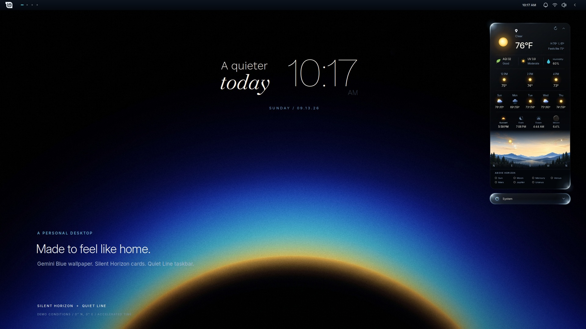
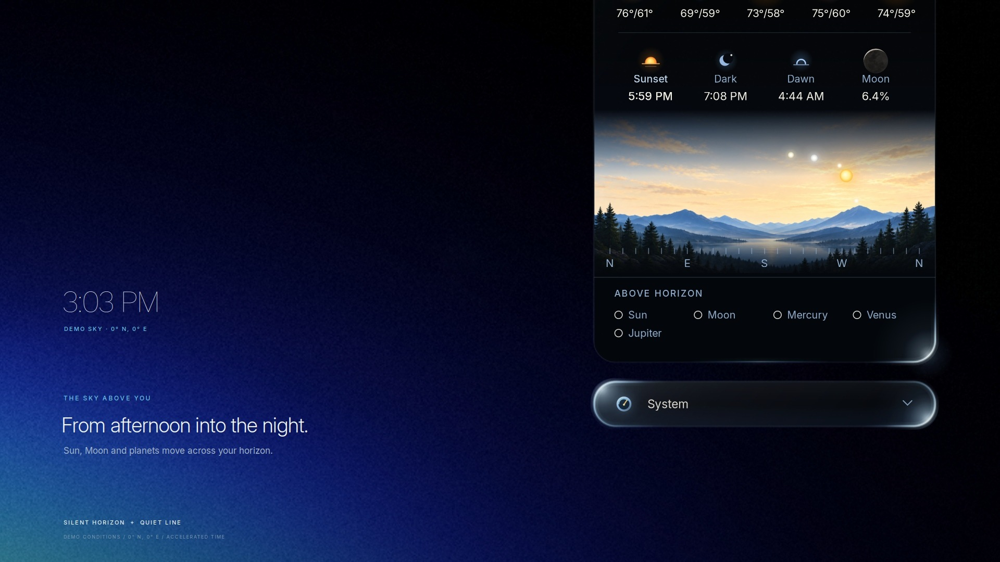
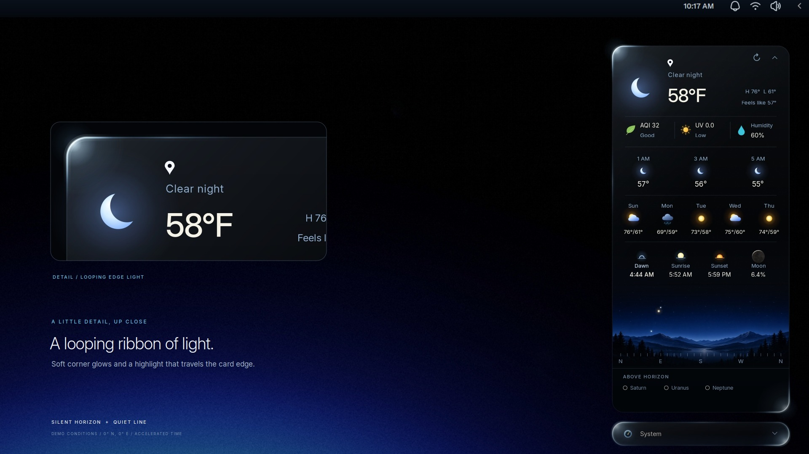
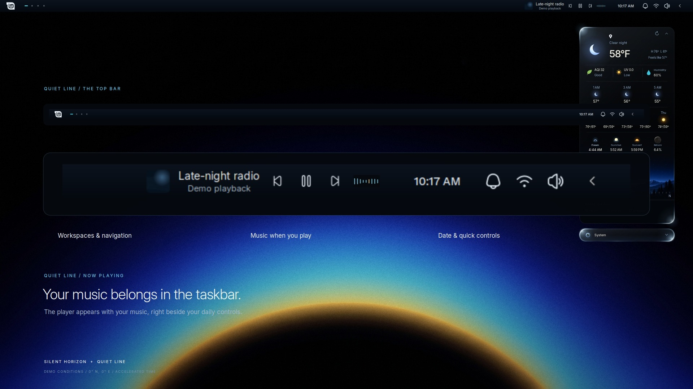

# Silent Horizon + Quiet Line

A quieter desktop for **Linux Mint Cinnamon**. Weather, a living sky, a delicate clock, and music that finds its place in the taskbar.



**[Watch the 40-second preview](https://github.com/PersianVibeCoder/silent-horizon/releases/latest/download/Silent-Horizon-Preview.mp4)** · **[Download the complete installer ZIP](https://github.com/PersianVibeCoder/silent-horizon/releases/latest/download/silent-horizon.zip)**

## The little details

- **Weather with personality:** illustrated conditions, hourly and five-day forecasts, air quality, humidity and UV.
- **Your horizon:** the Sun, Moon and planets above the horizon, spread across a complete panorama. Click an object's name to highlight its position.
- **A looping ribbon of light:** soft corner glows and a moving highlight around the glass cards.
- **Room to breathe:** collapse Weather and System into compact header bars, or expand them for a closer look.
- **Music in the taskbar:** Quiet Line's Now Playing appears when compatible MPRIS players are active, with playback controls and a small audio visualizer.
- **A useful top bar:** workspace navigation, app search, an expandable tray, quick controls and a performance dashboard.
- **The complete look:** Gemini Blue wallpaper and the fonts used by the cards are included.





The preview uses demonstration weather and accelerated time. Its observer coordinates are **0°, 0°**; it does not show the author's location. Playback animation and weather transitions in the presentation are choreographed to demonstrate the design.

## Install

Built on **Linux Mint 22.3 with Cinnamon**. Other recent Cinnamon distributions may work but are not yet verified. This is not a GNOME extension or a KDE widget pack.

1. Download the **[complete ZIP](https://github.com/PersianVibeCoder/silent-horizon/releases/latest/download/silent-horizon.zip)** and extract it.
2. Open the extracted `silent-horizon` folder in your terminal.
3. Run:

   ```bash
   bash install.sh
   ```

The installer explains the changes, asks before installing, installs the needed packages through your distribution, backs up affected files and desktop settings, and applies the full layout. Run it as your normal user; it asks for `sudo` only for system packages. Log out and back in afterward so Cinnamon loads the new components and fonts.

**The full layout replaces your panel layout and wallpaper.** Existing desklets remain. Your previous layout can be restored with the command printed at the end. Backups stay on your computer in `~/.local/state/silent-horizon/backups/`.

Prefer to keep your taskbar and wallpaper?

```bash
bash install.sh --layout widgets
```

This enables the clock and weather desklets and installs the other assets without activating the taskbar layout or changing your wallpaper.

Preview the installation without making changes:

```bash
bash install.sh --dry-run
```

On distributions without APT, install Python 3, PyGObject, Pillow, GTK 3 introspection, `cava`, `pactl` and `fontconfig` with your package manager, then run `bash install.sh --no-deps`. Cinnamon must already be installed. Missing GPU sensors are shown as unavailable; no graphics drivers are installed by this project.

## Set your location

The release starts with **latitude 0, longitude 0, elevation 0 and a blank location label**. It does not automatically detect your location. Until you configure it, weather and astronomy refer to those coordinates, not where you live.

Right-click the weather desklet → **Configure** → enter your latitude, longitude, elevation and preferred label. Choose Fahrenheit or Celsius there too. Weather refreshes approximately every five minutes; the sky recalculates as time passes. Use the refresh arrow whenever you want a fresh update.

“Above horizon” is a geometric position, not a promise that you can see an object with your eyes: daylight, clouds and an object's brightness affect visibility. Faint planets are included intentionally.

## Restore your previous desktop

Use the exact restore command printed by the installer, or choose a timestamp from the backup folder:

```bash
python3 scripts/install.py --restore ~/.local/state/silent-horizon/backups/YOUR-BACKUP-TIMESTAMP
```

Restoring replaces this installation's affected files and settings with the saved versions. It also undoes subsequent edits to those affected files. For multiple installs, restore the newest backup first. Dependencies installed with APT are left installed.

## Privacy and network access

Only application code and distributable assets are included. Personal Cinnamon settings, cache files, media history, credentials and author location are excluded. Updates reuse the recipient's existing desklet settings instead of resetting their chosen location.

Weather and air-quality requests send the configured coordinates to **Open-Meteo**. Media integration reads local MPRIS player metadata; artwork may be retrieved from a player's artwork URL or YouTube thumbnails. The audio visualizer uses the playback monitor, not the microphone. System metrics are read locally.

## Troubleshooting

- **Cards do not appear:** log out and back in; check Cinnamon's Desklets window for Silent Horizon. Enable two instances, setting one to Clock and one to Weather.
- **Music is missing:** start playback in an MPRIS-compatible player or browser. The media component lives in the taskbar and hides when inactive.
- **Visualizer is empty:** check that `cava` and `pactl` are installed and a PulseAudio-compatible playback monitor exists.
- **Layout needs adjusting:** right-click a desklet, unlock its position, and change its scale or drag it. “Restore recommended layout” repositions it for the current monitor.
- **Weather is unavailable:** check connectivity and your coordinates; use the refresh button. Cached data may be shown when requests fail.

## Development and contributions

The code is plain Cinnamon JavaScript with small Python helpers; no build step is needed. Run `python3 -m unittest discover -s tests` for installer and release checks. Changes to the running desktop may require a Cinnamon reload or a new login session.

Please include your Cinnamon version, distribution and reproduction steps in bug reports. Remove coordinates, location labels, media titles and other private details from screenshots and logs before sharing.

Created by **[PersianVibeCoder](https://github.com/PersianVibeCoder)**. See [credits and third-party notices](CREDITS.md) and [the project license](LICENSE).
